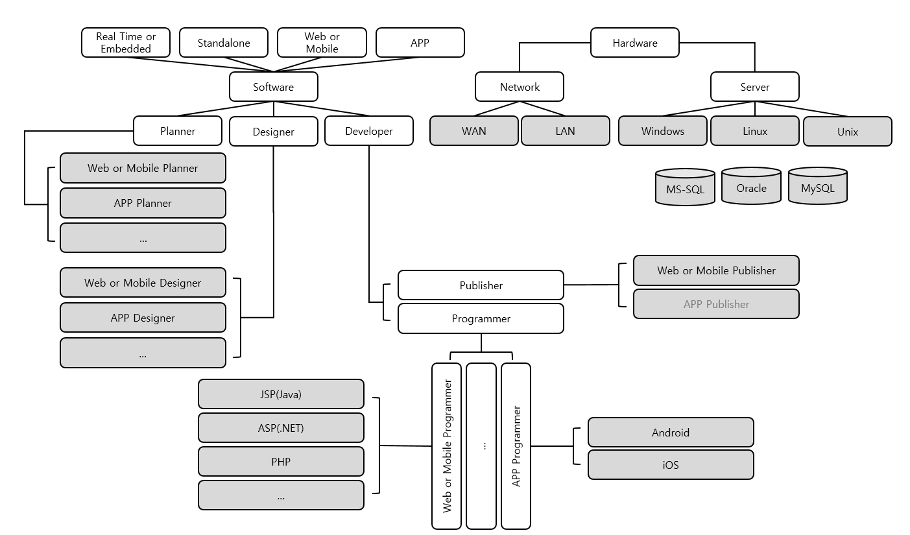
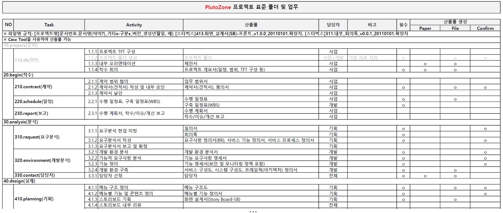
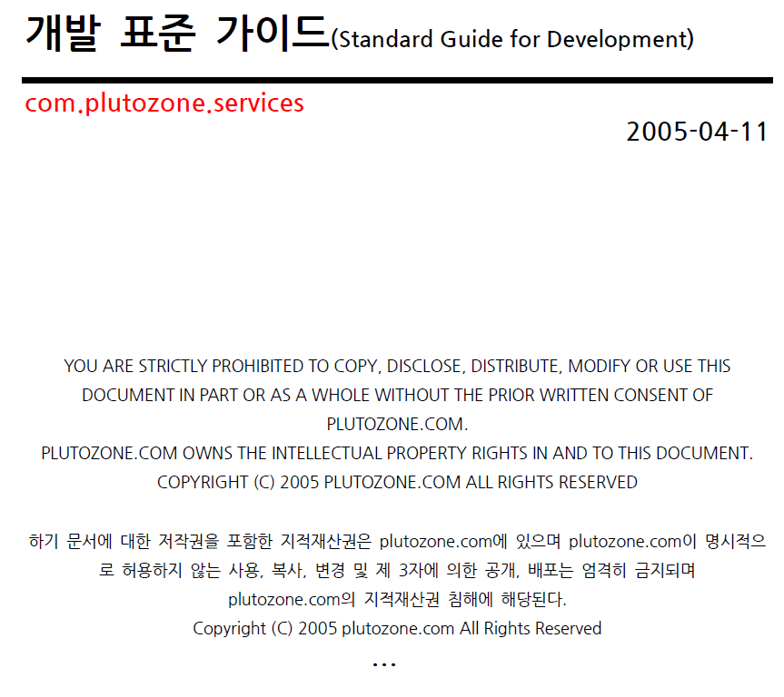
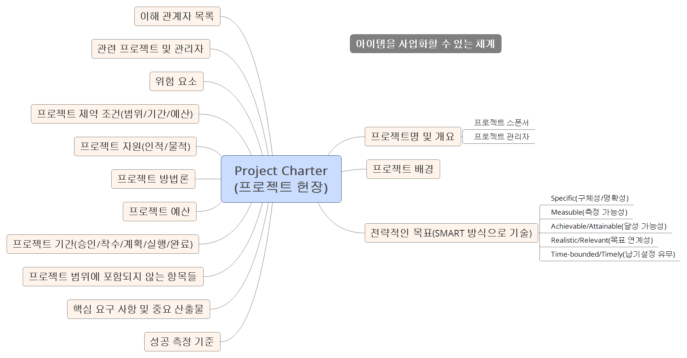
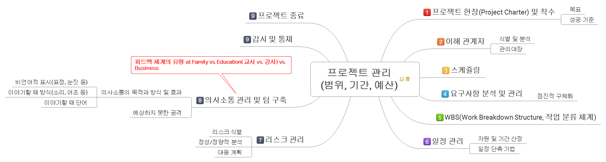
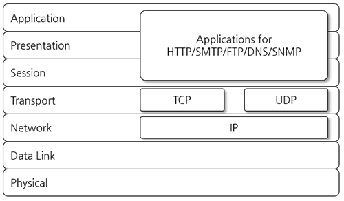
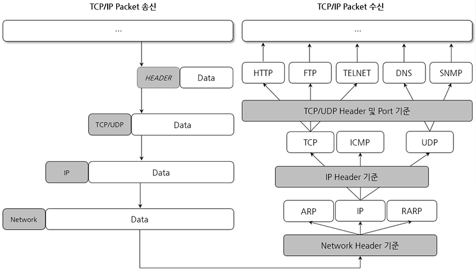
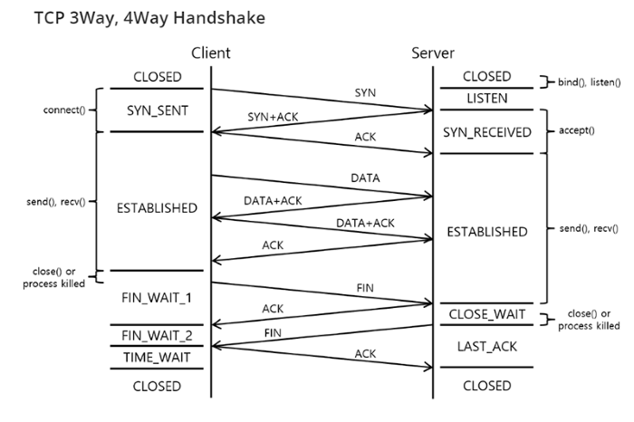
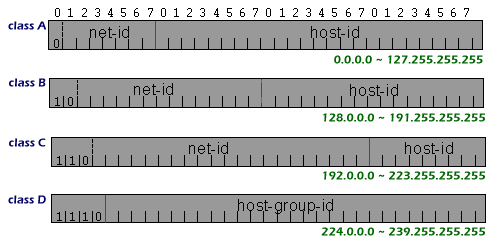
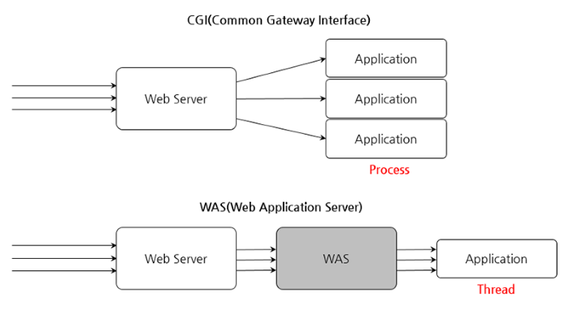

# com.plutozone.knowledge.fundamental.Education

## Keynote
- 직업 교육(Education) vs. 직업 훈련(Training)
- 교육의 가장 중요한 목적은 동기 부여
- Fundamental vs. Basic
- Developer in IT(Information Technology)
- Illiterate, User, End User, Administrator, Nerd(Geek), Hacker, Guru, Wizard
- Science vs. Engineering
- 1 vs. 0 + true vs. false + Sever vs. Client + PC vs. Server & Network + IDC vs. Cloud
- Network + Programming + Database
- [학습 목표-1] "Main Project"를 목표로 한 "과목과 솔루션" 교육
- [학습 목표-2] 1) 면접 시 자세와 의지 및 프로젝트 산출물 2) 참여 기업 솔루션 3) 정보처리기사

## Contents
1. 과정 및 자기 소개 등
2. 정보기술(IT, Information Technology) 조직도
3. 업무 프로세스와 개발 표준 가이드 for 웹 개발자
4. 선택과 준비
5. Network와 NOS 그리고 Server와 Client
6. Programming Language 종류와 특성
7. Data와 Database, DB 종류와 특성 그리고 DBMS
8. Tools
9. 향후
10. 로컬(local) 및 서버 시스템 환경 설정 등 그리고 과목 교육 시작

## 과정 및 자기 소개 등
### 훈련(Training) 과정명
- JAVA와 AI/RPA/빅데이터를 활용한 E-커머스 개발자 양성 취업과정 vs. Java와 AI 및 Big Data를 활용한 e-Commerce 웹 개발자 양성 과정

### 훈련(Training) 기간
- 6개월(26주) = 80시간(선행 학습 2주) + 960시간 = 1040시간

### 정보 기술(Information Technology) 분야
- [NOS] Windows, Ubuntu
- [Programming] HTML, CSS, JavaScript(jQuery)
- [Programming] Java, JSP, Spring, Python(Machine Learning + Deep Learning), Android
- [Database] Oracle, MariaDB, ANSI SQL
- [Solution] UiPath

### 과목 상세(시간 포함)

### 자기 소개
- 강사 그리고 교육생(이름, 희망 분야-조직도 참고), 취미, 하고 싶은 말 등

### 요청 및 문의 사항
- 교육 수준(특급 vs. 고급 vs. 중급 vs. 초급 vs. 입문)
- 심화 및 보충 교육 방안

### 확인 및 참고 사항
- 반장, 팀 구성(역할 포함)과 팀장
- 정보처리기사 취득
- 교육 수료 이전 취업
- 키보드와 마우스
- 포스트잇(요구 사항, 기능 등)과 배너(ERD 등)

## 정보기술(IT, Information Technology) 조직도
- NCS(National Competency Standards, 국가직무능력표준-https://www.ncs.go.kr)
- 정보 기술(IT, Information Technology) vs. 정보 통신(IT, Information Telecommunication)
- Software Architect(SA, 소프트웨어 아키텍트)의 분류
	- AA(Application Architect: 개발 표준, 프레임워크 등 설계자)
	- TA(Technical Architect: OS, WAS, DB 설치 등 하트웨어와 네트워크 담당자)
	- DA(Data Architect: 데이터 표준, 구조, 마이그레이션 등 설계자-DBA의 상위 개념)
	- BA(Business Architect: 기술적 관점이 아닌 업무 관점의 프로세스 설계자-실제 고객의 요구에 따라 첫 개발 지표가 되는 부분)
	- QA(Quality Assurance: 산출물과 소스코드에 대한 품질 담당자)

## 업무 프로세스와 개발 표준 가이드 for 웹 개발자
### 업무 프로세스

### 개발 표준 가이드 for 웹 개발자

## 선택과 준비
### 미래를 위한 선택
- Science(과학) vs. Engineering(공학) and Pure(순수) IT vs. Application(응용) IT
- APP(iOS, aOS) vs. Web
- Frontend vs. Backend
- [참고] 1) 자기 소개서 2) 프로젝트 산출물(프로젝트 팀에서 역할, 헌장 및 관리 포함)

### 현재를 위한 준비와 프로젝트 헌장 및 관리 그리고 개발
- [필수] e-Commerce + [필수] Web(관리자 또는 판매자) + [필수] APP(구매자)
- [권장] 용어, 폰트, 로고 및 양식 등
- [중요] 1) 목표 프로젝트(헌장)을 분석 및 설계하고 2) 과목과 솔루션을 진행하면서 모듈화하여 3) 구현 및 관리
- [산출물] 요구 사항, 분석, 설계, 화면(프론트 vs. 백앤드 + 웹 vs. 앱 등)과 기능(화면 vs. 로직 vs. API 등) 그리고 검증

## Network와 NOS 그리고 Server와 Client
### Network Fundamentals
- 교육장 또는 홈 네트워크(공유기 또는 백본 포함) 정보 + DNS(hosts) 변경을 통한 변조 등을 확인하고 재구축 또는 재설정
- What’s Network? Computer(PC, Main Frame) 또는 System(Any Device)이 서로 연결되어 정보를 공유(Share) 또는 통신(Communication)할 수 있게 만든 체계 예) Printer(NIC On Board) + PC, Embedding(PAD, Cellular) + PC
- What’s Internet(Inter + Network)?
- Internet Service
	- WWW
	- FTP
	- Telnet
	- E-Mail 등
- The Benefit of Network
	- Share(Device, Database, Software, Internet Service) 예) Share Printer(Printer Server), Share Directory/Files, Microsoft Office, WinRoute/ICS/NAT
	- Communication 예) Battle Net(Battle Net Server), Message, E-Mail(Mail Server)
	- Management
	- Resource Management
	- 구형 시스템 활용
- 회선 공유 방식에 따른 Network 분류
	- Circuit 교환 방식(예: Telephone)
	- Packet 교환 방식(예: Ethernet)
- LAN(Local Area Network) 구성 장비(Ethernet Type 경우)
	- Transmit Media(전송 매체)는 신호 전달 예) TP(Twisted Pair), S(Shielded)TP, U(Unshielded)TP, Coaxial(동축), Optical Fiver(광) Cable 또는 Wireless
	- NIC(Network Interface Card)는 신호 전송
	- Hub 또는 Switch는 Network Cable 집중하고 신호 복원(충돌 검사)
	- Router는 LAN과 LAN을 연결
- 로컬과 교육장의 LAN 구성 장비 확인
- Ethernet
	- OSI 7 Layer의 가장 하위 층인 Physical과 Data Link Layer를 정의
	- 가장 광범위하게 설치된 근거리통신망 기술
	- CSMA/CD(Carrier Sense Multiple Access/Collision Detection) Protocol을 이용하여 경쟁적으로 Access
	- 10Mbps, 100Mbps(Fast Ethernet), Gbps 등
	- MAC Address(OSI 7 Layer: Data Link)는 NIC 제조사별 유일한 주소
	- Coaxial/Twist Pair/Fiber Cable 등 전송매체를 사용
- Network 구축을 위한 사전 고려 사항
	- 구축 목적(Resource 공유, Groupware, Management 등)
	- 고려 사항(도입 목적에 따른 장/단기 계획, 규모, 호환성, 유지보수, 경제성*, 신뢰성, 사용/관리 용이성 등)
- Network 구축 방법
	- Home Network(PC to PC, Cable 등)
	- 소규모 Network(About Host 10, Hub 등)
	- 중규모 Network(Over Host 30, Switch 등)
- Step for Building LAN
	- Make UTP/STP Cabling(568B + Direct or Cross + RJ45 + Crimping Tool + Tester + ...) + Tagging + Line + Connect(LED Lamp 등)
	- NIC Configuration(OS에 따른 Driver 및 Service + TCP/IP 등 Protocol)
- OSI 7 Layer
	- 7 계층: 응용(Application) 예) Web Browser
	- 6 계층: 표현(Presentation) 예) HTTP
	- 5 계층: 세션(Session) 	예) Connection Maintain
	- 4 계층: 전송(Transport) 예) Port
	- 3 계층: 네트워크(Network) 예) IP
	- 2 계층: 데이터 링크(Data Link) 예) MAC
	- 1 계층: 물리(Physical) 예) Device and Cable

### From LAN(Local Area Network) To WAN(Wide Area Network)
- ISP(Internet Service Provider: SKT, KT, LG U+ 등)의 서비스 종류, 속도, 가격, 인지도 고려하여 선택
- Network 문제 발생 시 점검 순서
	- Local
	- Switch and Node
	- Gateway
	- Target System at WAN

### TCP/IP(Transmission Control Protocol/Internet Protocol)
- What’s protocol?
	- (Network) 통신 상에서 두 장치간의 정보 교환 시 통신 방식을 정해 놓은 일종의 규칙
	- 전달할 신호 절차, 종류, 순서, 정보를 정의
	- TCP/IP, NetBEUI, IPX/SPX, AppleTalk 등
- TCP/IP(Transmission Control Protocol/Internet Protocol) Protocol
	- 인터넷 표준 Protocol
	- OSI 7 Layer의 Transport Layer(TCP)와 Network Layer(IP)가 혼합된 형태로 응용 Protocol(HTTP, FTP, …)의 Base Protocol

- TCP/IP 데이터 전송 과정

- TCP/IP Handshake(가상 회선의 상태와 의미)

- IP(Internet Protocol) Address Class

- Subnet Mask
- Gateway IP
- Class 당 예약되어 사용할 수 없는 IP
- 사설 IP
	- A 10.0.0.0
	- B 172.16.0.0 ~ 172.31.0.0
	- C 192.168.0.0 ~ 192.168.255.0
- Packet 전송 방식
	- Unicast(Host간 1:1 Packet 전송)
	- Multicast(멀티캐스트 그룹에 속한 모든 호스트에 Packet 전송 또는 Class D)
	- Broadcast(Network IP 내의 모든 호스트에 Packet 전송)

### Internet Service
- WWW
- DNS
- SMTP/POP3
- SSH
- SFTP, FTP 등

### Network Tool for Diagnosis and Management
- ipconfig/ifconfig
- ping
- netstat
- traceroute/tracert

### NOS
- Microsoft Windows Network(Protocol, File/Print Sharing 등) 설치와 대표적인 Service(Active Directory, DNS, DHCP, IIS 등)
- Linux Network 설치와 대표적인 Service
- Docker, VM 및 Cloud

### Server
- Web Server는 다음과 같은 요청된 정적 리소스에 대한 응답을 위한 시스템을 말하며 대표적으로 Nginx, Apache Web 등
	- HTML
	- CSS
	- JavaScript
	- Image 등
- WAS(Web Application Server)는 3 Tier 구조에서 Client와 Server의 중간에서 다음과 같은 Business Logic 처리를 위한 시스템을 말하며 대표적으로는 Tomcat(Apache), WebSphere(IBM), WebLogic(BEA), NAS(Sun), TOInB(Shift), Zeus(Tmax), Resin(Caucho) 등
	- DB Connection과 Cache 기능을 지원하여 Access 속도 향상
	- CPU 성능을 최대화 하기 위한 System Processing 속도 개선
	- 부하분산을 위한 Load Balancing 기능
	- 다기능(Multi)을 운영할 수 있는 분산 처리 기능 제공
	- Data의 신뢰성 확보를 위한 동기화 및 동시 처리 보장
- 부하 분산과 확장성을 위한 Server(WEB + WAS + Database) 설계
- Web Server, WAS의 설치, 운영 그리고 연동
- WAS vs. CGI(WAS와 CGI의 기본적인 구조는 같으나 Web Server가 Application을 사용하는 방식에 차이가 있다. 또한 Application은 구현 방식에 따라 실행 코드 방식과 Script Code(JSP, ASP, PHP 등) 방식으로 구분)

### Client
- Web Browser에는 Chrome, Edge 등이 있다.
- Web Browser를 통하여 HTML, CSS, JavaScript가 어떻게 Client로 Download되는지 확인

## Programming Language 종류와 특성
### Programming Language 선택 = 핵심 기능 + 형태 또는 방식 + 운영 환경
- 주식 매매(속도) vs. 계좌 이체(트랜잭션) vs. 홈페이지(정보) 등
- Web Page vs. GUI vs. TCP/IP를 기반으로 한 데이터 통신 등
- HP-UX vs. Linux vs. Windows 등

### Programming Language 종류와 특성
- Interpret(Source Code + Small Size + Run Slowly) 예) Basic, ...
- Runtime or Script(Pseudo Code + Middle Size + Run Quirky) 예) Visual Basic 1.0 ~ 4.0, Java, JSP/ASP/PHP, Python, ...
- Compile(Native Code + Big Size + Run Fast) 예) C/C++, Visual C++, Delphi, Visual Basic 5.0 Over, ...

### OOP(Object Oriented Programming)
- C++, Delphi, Smalltalk, Ada, Java, ...
- Object(Class) = Method + Property + Event

### RAD(Rapid Application Development) Tool
- Eclipse, IntelliJ, STS 등

## Data와 Database, DB 종류와 특성 그리고 DBMS
### Data vs. Database vs. DBMS vs. RDBMS
- 자료(Data) vs. 정보(Information) vs. 데이터베이스(Database)
- TXT(ANSI vs. UTF-8/16) vs. CSV vs. XLSX 그리고 Database vs. RDMBS/ODBMS
- 대용량 Low Data(원본: GB 단위의 txt)를 DB화(결과: 수 GB 단위의 csv 또는 수십 GB 단위의 DB) 

### 종류와 특성
- MSSQL, Oracle, MariaDB 등

### SQL(Structured Query Language)
- ANSI vs. PL/SQL vs. T-SQL 등

### Client Tool
- Toad, SQL Developer, HeidiSQL 등

### ERD(Entity Relationship Diagram) Tool
- https://www.erdcloud.com/, draw.io
- eXERD, MySQL WorkBench, ERWin 등

## Tools
### Presentation
- Zoomit, Epic Pen
- https://codeshare.io
- https://www.shorturl.at

### Requirement
- XMind or 알Mind

### UI 또는 SB(Story Board)
- https://ovenapp.io/, https://www.canva.com/
- Pencil

### Domain
- https://whois.co.kr/, https://후이즈검색.한국 또는 https://xn--c79as89aj0e29b77z.xn--3e0b707e/

### Network
- Visual Route, Advanced IP Scanner, WinShark

### SSH + SFTP
- MobaXterm vs. Putty + FileZilla

### ER 또는 UML 등
- https://app.diagrams.net/ 또는 https://draw.io
- StarUML, MarkDown(MD)
	
### 형상관리(CM, Configuration Management) 또는 소프트웨어 구성 관리(SCM: Software Configuration Management) 등
- Git + GitHub + GitLab vs. Visual SVN 그리고 Client Tool(SourceTree, TortoiseSVN)
- Redmine
	
### Code + Text
- Visual Code, Notepad++, mTail, vi, nano(atom)
	
### HTML + CSS
- https://caniuse.com/, https://csscompressor.com/

### Java 등
- Launch4j, Selenium
- https://ideone.com/

### JSON
- https://codebeautify.org/jsonviewer
- Postman
	
### Graphic + Image 등
- https://pixlr.com/kr/editor/, https://pixabay.com/, https://thenounproject.com/
- Inkscape, articons
	
### Virtual Machine
- Virtual Box
- BlueStacks, Nox
	
### Stress Tool
- Jmeter

## 향후
### 6개월 후
- 분야와 취업에 대한 고민

### 1년 후
- 해야 할 일에 대한 고민

### 3년 후
- 현재에 대한 고민

### 6년 후
- 미래에 대한 고민

### 10년 후
- 나의 길에 대한 고민

## 로컬(local) 및 서버 시스템 환경 설정 등 그리고 과목 교육 시작
### 로컬 확인
- 예제 파일, 데모(Win Route 등) 프로그램 등 삭제
- 레지스트리  최적화
- 개인 최적화(classic-shell 등)

### 로컬 환경(초기화 포함) 설정 및 핵심 툴 사용법
- Java(환경 변수 등 포함)와 Eclipse(GitHub 등 연동 포함)
- …

### 서버 환경(초기화 포함) 설정 및 관리
- Windows, Ubuntu 등 NOS
- GitLab 등
- Nginx, Tomcat 등
- MariaDB, Oracle 등

### 과목 교육 및 프로젝트 시
- [중요] 1) 개념과 목차 그리고 나를 위한 문서화와 용도에 따른 코드화 2) 자동 완성 그리고 3) 검색
- 6개월간 16개 과목(Network, OS 포함) + Mini Project + Main Project
- PBL(Project and Problem based Project)
